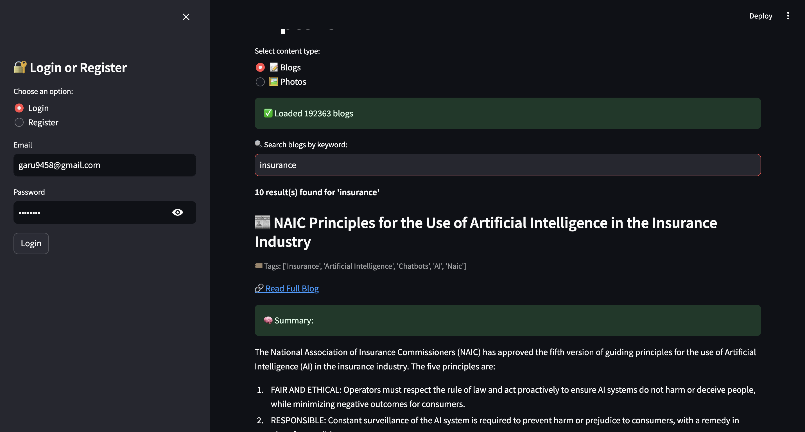

### 📄 `README.md`

```markdown
# 🧠 InsightSwitch — Smart Blog & Media Explorer

A full-stack intelligent search and summarization platform for blogs and media.  
Built with Python, Streamlit, ElasticSearch, Kafka, Redis, and local LLMs via Ollama.

---
## 📸 Screenshot



## 🚀 Features

- 🔍 **Keyword Search**: Search over 190K real blog articles.
- 🧠 **LLM Summarization**: Generate summaries using Mistral / LLaMA 3.2 via Ollama.
- 📚 **ElasticSearch**: Fast, scalable keyword & tag-based search.
- 🧾 **Kafka + Redis**: Asynchronous summary request queue and in-memory caching.
- 🤖 **More Like This** (optional): Placeholder for vector similarity or elastic suggestions.
- 🔐 **Login + Activity Tracking**: Basic email-password login & SQLite logs user queries.
- 📸 **Future-proof for Photos**: Toggle for images/media types.
- 🗂️ **Modular Structure**: Easily extensible and readable codebase.

---

## 🗂️ Project Structure

```

search\_app/
│
├── .venv/                  # Virtual environment (ignored by Git)
├── data/                   # Parquet dataset of real blog articles
├── scripts/                # All logic scripts (load, recommend, Kafka, Elastic)
│   ├── kafka\_consumer.py
│   ├── kafka\_producer.py
│   ├── load\_data.py
│   ├── recommender.py
│   └── index\_to\_elastic.py
│
├── users.db                # SQLite DB storing search logs (email, keywords)
├── docker-compose.yml      # Kafka, Zookeeper, Redis, ElasticSearch containers
├── streamlit\_app.py        # Main UI
├── README.md
└── requirements.txt

````

---

## ⚙️ Setup Instructions

### 🐍 1. Create & Activate Virtual Environment

```bash
python3 -m venv .venv
source .venv/bin/activate
pip install --upgrade pip
pip install -r requirements.txt
````

---

### 🐳 2. Start Required Services with Docker

```bash
docker-compose up -d
```

This will spin up:

* Kafka + Zookeeper
* Redis
* ElasticSearch

---

### 🔌 3. Index Blogs into ElasticSearch

```bash
python scripts/index_to_elastic.py
```

---

### 🧠 4. Run Kafka Consumer to Generate Summaries via Ollama

Ensure Ollama is running in a separate terminal:

```bash
ollama serve
```

Then:

```bash
python scripts/kafka_consumer.py
```

---

### 🌐 5. Launch Streamlit App

```bash
streamlit run streamlit_app.py
```

Go to [http://localhost:8501](http://localhost:8501)

---

## 💾 Redis Caching

Summaries are stored using Redis with the blog title as the key (`title.lower().replace(" ", "_")`).

---

## 📝 Search Logging

All searches are logged in `users.db` with:

* `email` (from login)
* `keyword`
* `timestamp`

Query this data for behavior analytics.

---

## 🧪 Example Flow

1. User logs in → UI shows 190K+ blogs
2. Searches "AI in insurance"
3. Top 10 relevant blogs are shown
4. On click, a summary is generated via Ollama LLM and stored in Redis
5. Summary is displayed (or fetched if already cached)

---

## 🛠️ Tech Stack

| Component     | Tool                         |
| ------------- | ---------------------------- |
| UI            | Streamlit                    |
| Database      | SQLite                       |
| Search Engine | ElasticSearch                |
| Async Queue   | Kafka + Zookeeper            |
| Cache Layer   | Redis                        |
| LLM Runtime   | Ollama + Mistral / LLaMA 3.2 |
| Vector Search | (planned) FAISS or Elastic   |

---

## ✨ Future Enhancements

* 🧭 Vector Embedding Search (OpenAI / Sentence Transformers)
* 📊 Streamlit Analytics Dashboard
* 🔐 JWT + Auth0 for secure login
* 📥 Upload your own corpus
* 📸 AI image caption search

---

## 📚 Credits

* [Mistral by Ollama](https://ollama.com)
* [ElasticSearch](https://www.elastic.co)
* [Streamlit](https://streamlit.io)
* [Kafka](https://kafka.apache.org/)
* Real blog dataset from Kaggle

---

## 📜 License

Anurag Mishra
